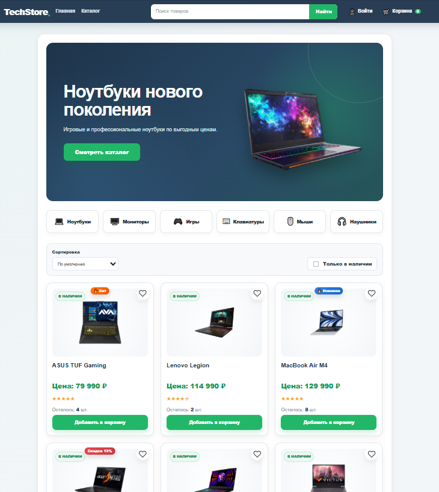
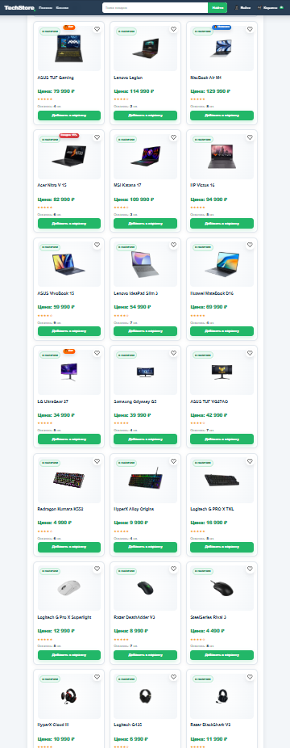
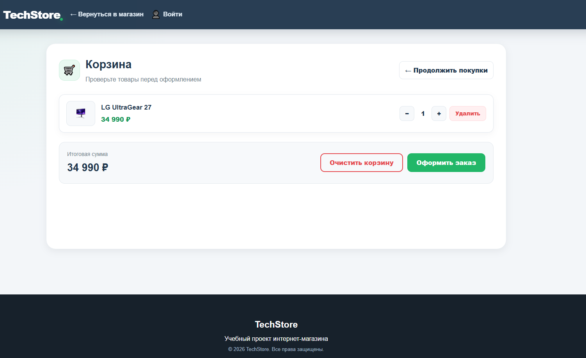

# 🛒 TechStore

## О проекте

**TechStore** — учебный проект интернет-магазина, выполненный в рамках формирования портфолио бизнес-аналитика.

Проект включает полный цикл бизнес-анализа: от сбора требований и моделирования бизнес-процессов до разработки клиентского веб-приложения.

---

# Моя роль

**Бизнес-аналитик**

В рамках проекта были выполнены:

- Анализ предметной области
- Сбор и формализация требований
- Подготовка технического задания (SRS)
- Разработка Product Backlog
- Подготовка User Stories
- Построение UML Use Case Diagram
- Построение BPMN 2.0
- Проектирование ER-диаграммы
- Разработка архитектуры системы
- Подготовка функциональных требований
- Подготовка нефункциональных требований
- Разработка HTML/CSS/JavaScript-прототипа

---

# Используемые технологии

- HTML5
- CSS3
- JavaScript
- Draw.io
- Git
- GitHub
- BPMN 2.0
- UML
- SQL

---

# Документация проекта

В репозитории представлены:

- Концепция проекта
- Функциональные требования
- Нефункциональные требования
- Software Requirements Specification (SRS)
- Product Backlog
- User Stories
- UML Use Case Diagram
- BPMN 2.0
- ER-диаграмма
- Архитектура системы

---

---

# 📸 Скриншоты

## Главная страница



---

## Каталог



---

## Карточка товара


---

## Корзина



---

## Авторизация


---

## Личный кабинет


# Возможности системы

- Просмотр каталога товаров
- Поиск товаров
- Фильтрация
- Сортировка
- Карточка товара
- Корзина
- Регистрация
- Авторизация
- Личный кабинет
- Избранное
- История заказов

---

# Структура проекта

```text
TechStore
│
├── Документация/
├── Изображения/
├── index.html
├── cart.html
├── login.html
├── profile.html
├── product.html
├── register.html
├── style.css
└── script.js
```

---

# Автор

**Игорь Фролов**

Проект выполнен для формирования портфолио бизнес-аналитика.
**Игорь Фролов**

Проект выполнен для формирования портфолио бизнес-аналитика.
